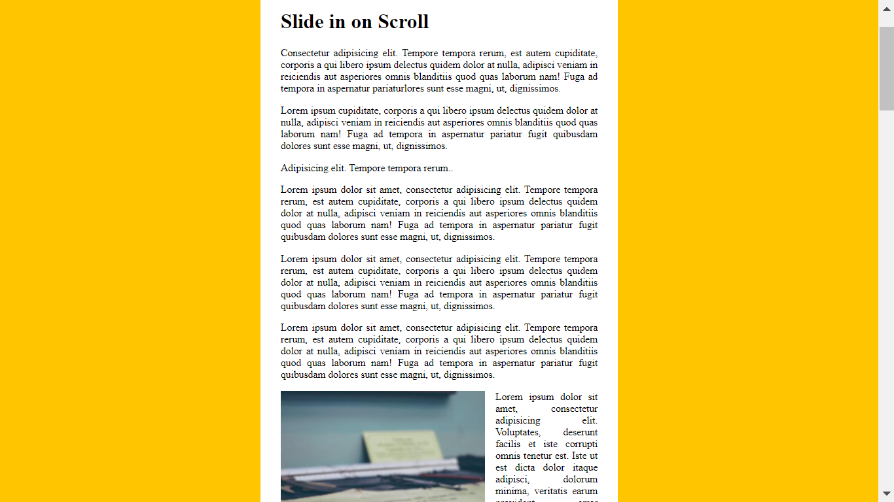

# JS-30-DAY-13

<h1 align="center">Slide in on Scroll</h1>

## [demo](https://cenacrharsh.github.io/JS-30-DAY-13/)

## [BLOG](https://dev.to/cenacr007_harsh/javascript-30-day-13-337i)**

## Lessons Learned:
- learned the use of `debouncer` function and used a lot of coordinare properties on windows and images like `window.scrollY` `window.innerHeight` `offsetTop` and `height`

